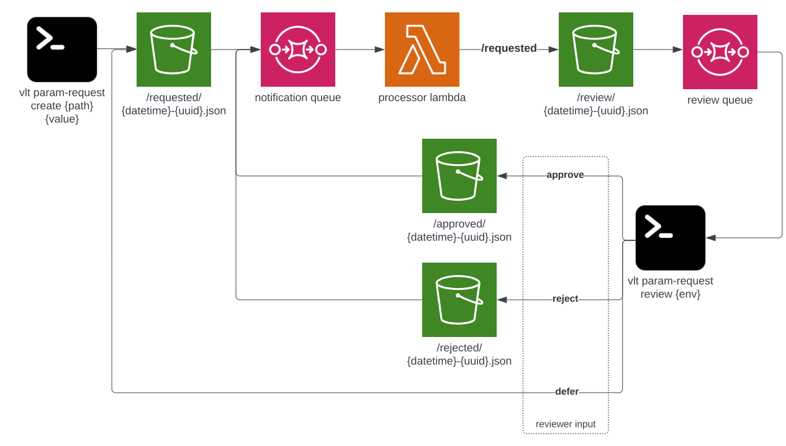

# Installing

## Infra

This tool relies on AWS infrastructure, which has not been well abstracted out. This repo is intended for educational purposes, so you're mostly on your own for setting up the infra, though a terraform module is included (see `infra/` in the source code).

## CLI

You can install this tool from the git repo using `pip`. You can also install it from the git repo via poetry, but there are [some caveates](#via-poetry) if you install that way.

### Via Git

You can clone this repo, and then install the CLI via pip

1. clone repo: `gh repo clone moui72/dev-tools` or `git clone git@github.com:moui72/dev-tools.git`
1. from within the repo directory, install via pip with `pip install --editable .`[^editable]

### Via poetry

You can also install this application via [poetry](https://python-poetry.org/) rather than `pip`, but doing so will make it isolated to a virtual environment and therefore not globally available via the `dev` command, while the rest of this documentation assumes it is globally available.

If you choose to use poetry, be aware that all `dev ...` commands must be run from within the poetry-created venv, i.e., from within the project directory via `poetry run dev ...`.

1. clone repo: `gh repo clone moui72/dev-tools` or `git clone git@github.com:moui72/dev-tools.git`
1. from within the repo directory, install via poetry `poetry install`

# Design

Design documents for dev-tools. This was original created for Vault Health, but the code has been sanitized and made public for educational purposes.

## Param store

The basic design of the `param-store` set of commands is that objects are added to an S3 bucket, which triggers notification rules. The notification rules pipe messages into one of two SQS queue based the key prefix: `requested/`, `accepted/`, or `rejected/` go into the notification queue, while `review/`, goes into the review queue.



There are two commands for now: `request` and `review`. A successful `request` creates an S3 object with a key prefixed by `requested/`. The notifier lambda will move these object to the same key, but replacing the prefix with `review/`.

There is no lambda that processes the review queue; instead, that queue is consumed by the `review` command. A successful review will, depending on reviewer input, move the object to the same key, but replacing the prefix with `accepted/` or `rejected/` as appropriate. If the `review` command errors or the reviewer chooses not to approve or accept, the object will be moved back to the same key, but replacing the `review/` prefix with `requested/` so it can be reviewed again later.

# Contributing

Tools and ecosystem for development.

## Pre-commit

This repo uses [pre-commit](https://pre-commit.com/) to enforce style and manage code quality. Please run `pre-commit install` after cloning so that the hooks will run when you commit.

## Poetry

This project uses [poetry](https://python-poetry.org/docs/#installation) to manage dependencies and build the package. You will need to install it.

## Building docs

> :warning: Do not edit README.md manually, any changes will be overwritten by docs autogeneration!

This project uses the [typer-cli](https://typer.tiangolo.com/typer-cli/#generate-docs) to generate the usage documentation. The `README.md` is a concatenation of those autogenerated docs (the [`dev`](#dev) section) as well as some static markdown files, like this one. The static markdown files are in the `scripts` directory and can be edited.

Run `sh scripts/make_docs` or `pre-commit run --hook-stage manual` to autogenerate a new `README.md` file.

# `dev`

**Usage**:

```console
$ dev [OPTIONS] COMMAND [ARGS]...
```

**Options**:

- `--install-completion`: Install completion for the current shell.
- `--show-completion`: Show completion for the current shell, to copy it or customize the installation.
- `--help`: Show this message and exit.

**Commands**:

- `params`: Manage requests to change parameter store...
- `sso`: Manage your aws credentials

## `dev params`

Manage requests to change parameter store values

**Usage**:

```console
$ dev params [OPTIONS] COMMAND [ARGS]...
```

**Options**:

- `--help`: Show this message and exit.

**Commands**:

- `request`: Creates a new request to change the value of...
- `review`: Approve or reject requests for a given...

### `dev params request`

Creates a new request to change the value of PATH to VALUE

**Usage**:

```console
$ dev params request [OPTIONS] PATH VALUE
```

**Arguments**:

- `PATH`: \[required\]
- `VALUE`: \[required\]

**Options**:

- `-e, --encrypt / -n, --no-encrypt`: \[default: True\]
- `-n, --note <TEXT TEXT>...`: A note to attach to the request. Two values are accepted: the first is the subject and the second is the body of the note.
- `--help`: Show this message and exit.

### `dev params review`

Approve or reject requests for a given environment (i.e., `dev`, `qa`, `stage`, or `prod`)

**Usage**:

```console
$ dev params review [OPTIONS] ENVIRONMENT:[dev|qa|stage|prod]
```

**Arguments**:

- `ENVIRONMENT:[dev|qa|stage|prod]`: \[required\]

**Options**:

- `--help`: Show this message and exit.

## `dev sso`

Manage your aws credentials

**Usage**:

```console
$ dev sso [OPTIONS] COMMAND [ARGS]...
```

**Options**:

- `--help`: Show this message and exit.

**Commands**:

- `config`: Manage your AWS SSO configuration
- `login`: Authenticate with AWS SSO and generate a...

### `dev sso config`

Manage your AWS SSO configuration

**Usage**:

```console
$ dev sso config [OPTIONS] COMMAND [ARGS]...
```

**Options**:

- `--help`: Show this message and exit.

**Commands**:

- `add-profiles`: Add a new profile in your AWS config for each...
- `make-primary`: Renames a given (set of) profile(s) to...
- `new`: Create a new config file with ROLE (default:...
- `update`: Automatically migrates your aws-google-login...

#### `dev sso config add-profiles`

Add a new profile in your AWS config for each of the role(s) provided.

The resulting profile names will be in the form `dev[-{env}[-{role nickname}]]`, where -{env} is omitted for prod,
and -{role nickname} is omitted for the first role in the list of roles passed in.

**Usage**:

```console
$ dev sso config add-profiles [OPTIONS] [ROLES]...
```

**Arguments**:

- `[ROLES]...`: Should be a list of names of one or more AWS SSO permission sets, usually in the form {env}-{rolename}, e.g., QA-Developer. If adding QA-, Stage-, and Prod- for the same role, you can just list the role once with `all` as the env, e.g., `all-{rolename}` to represent all three.

**Options**:

- `--output-format [json|yaml|yaml-stream|text|table]`: \[default: yaml\]
- `--replace / --no-replace`: \[default: False\]
- `--help`: Show this message and exit.

#### `dev sso config make-primary`

Renames a given (set of) profile(s) to dev\[-{env}\]. If env is `all`, profile_name must also contain `-all` which
will be replaced by `-{env}` for non-prod profile names, but omitted for prod

**Usage**:

```console
$ dev sso config make-primary [OPTIONS] PROFILE_NAME
```

**Arguments**:

- `PROFILE_NAME`: \[required\]

**Options**:

- `--env [qa|stage|prod|all]`: \[default: prod\]
- `--help`: Show this message and exit.

#### `dev sso config new`

Create a new config file with ROLE (default: all-Developer).

**Usage**:

```console
$ dev sso config new [OPTIONS]
```

**Options**:

- `--output-format [json|yaml|yaml-stream|text|table]`: \[default: yaml\]
- `-f, --destroy-existing`: Replace your existing config file with new one. Existing will be backed up to config..dev-cli-backup-{timestamp} \[default: False\]
- `--role TEXT`: \[default: all-Developer\]
- `--help`: Show this message and exit.

#### `dev sso config update`

Automatically migrates your aws-google-login aws config file for use with the new Azure-AWS SSO paradigm, while
maintaining compatibility with aws-google-login

**Usage**:

```console
$ dev sso config update [OPTIONS]
```

**Options**:

- `--output-format [json|yaml|yaml-stream|text|table]`: \[default: yaml\]
- `--help`: Show this message and exit.

### `dev sso login`

Authenticate with AWS SSO and generate a credentials file (used automatically in many docker containers)

**Usage**:

```console
$ dev sso login [OPTIONS]
```

**Options**:

- `--help`: Show this message and exit.

[^editable]: The `--editable` option with `pip install` allows changes made to the source code to be immediately reflected on execution, without having to rebuild the package
